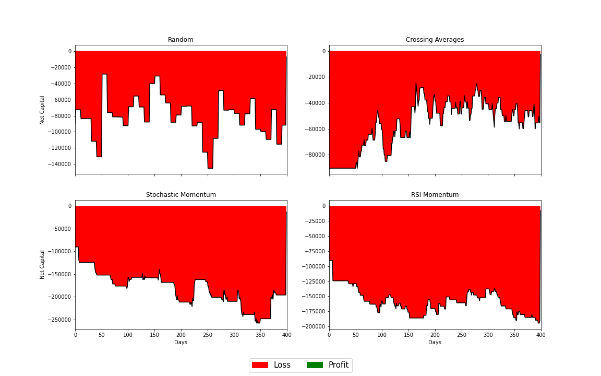

# Algorithmic Trading in Python
## Primer
Algorithmic trading is the use of computer programs to automate stock trading decisions based on available data such as share price or trading volume over different periods of time. 

In this project I have implemented four trading strategies whose performance were then evaluated using simulated stock price data. This work was inspired by work conducted by *Biondo et al.*  which compared random trading strategies to technical strategies. Details can be found in this [paper](https://journals.plos.org/plosone/article?id=10.1371/journal.pone.0068344).

An important assumption to note is that these trading strategies were implemented with the assumption that the trading agent holds infinite capital (wouldn't that be nice. Or would it?).

---

## `trading` Package
A Python package, `trading`, was constructed to perform this basic study which contains the following five modules: `data.py`, `process.py`, `indicators.py`, `strategy.py` and `performance.py`, as well as an initialisation script `__init__.py` to inform Python that `trading` is a **package** and not just a folder.

The `trading` package specifically implements the following four trading strategies:

* Random: Randomly buying and selling shares in stocks periodically.

* Crossing Averages: Selling shares in stocks when the fast moving average (FMA) surpasses the slow moving average (SMA). The converse operation is peformed when the SMA surpasses the FMA.
    
* [RSI](https://en.wikipedia.org/wiki/Relative_strength_index) Momentum: Using the relative strength index (RSI) value on a particular day to govern the kinds of transactions we perform.
    
* Stochastic Momentum: Using the [stochastic oscillator](https://en.wikipedia.org/wiki/Stochastic_oscillator) value on a particular day to govern the kinds of transactions we perform.

## DataViz
The fist visualisation presented enables one to gain a visual understanding of the Crossing Averages, Stochastic Momentum and RSI Momentum trading strategies. Note that buying and selling days for the RSI-based strategies were classified to be when the RSI value lay between .25 and .75. 

The figure below presentes the net capital holdings of an imaginary firm with each of the aforementioned trading strategies implemented independently. These are the results from a single simulation. To create this figure we randomly generate stock price data accounting for news events for 20 stocks each with an initial price of £500, and a relative volatility of £1. 

A total of 500 simulations were then conducted which achieved the following results:

    - Random Wins: 4
    - Crossing Averages Wins: 407
    - Stochastic Momentum Wins: 44
    - RSI Momntum Wins: 45
    - Net Profit Occurences: 55
    - Net Loss Occurences: 445

---
**This work was conducted as part of the Statistics with Data Science MSc programme offered by the University of Edinburgh.*
